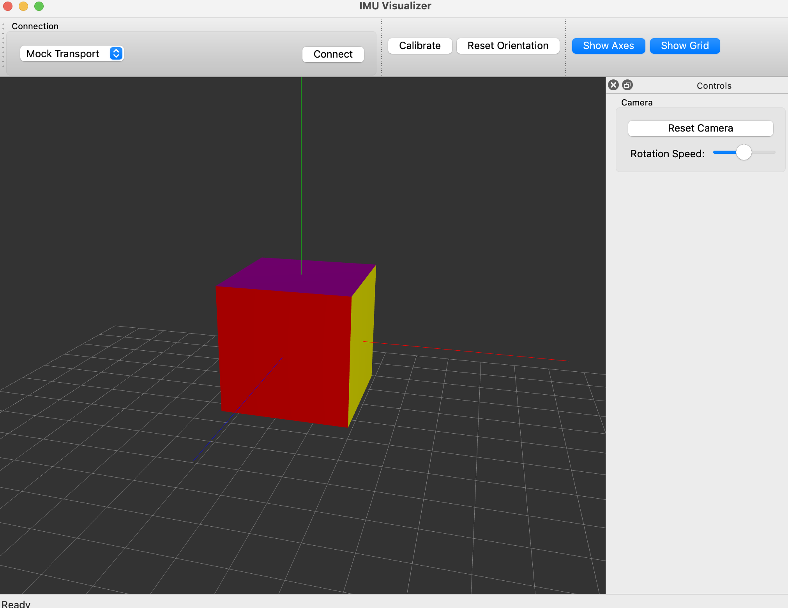

# IMU Visualizer

This project is a real-time 3D visualization system that combines embedded systems with graphics programming and is planned to be a small library/ tool for my smart home project with some microcontrollers. It uses a Qt interface with OpenGL to render a cube, controlling the orientation with an IMU. The IMU is connected to a Raspberry Pi Pico W for wireless sensor data transmission over TCP/IP. Sensor fusion algorithms (complementary, Madgwick, Kalman filters) were implemented to process the IMU data for smooth motion tracking. I'm currently working on implementing the main application on a Pi 4b as well to add into my smart home system. 

  

